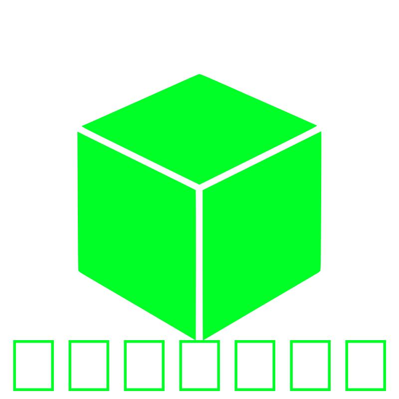

  <picture>
    <source
      width="350px"
      media="(prefers-color-scheme: dark)"
      srcset="Logo/Extenre_Green.svg">
    
  </picture>

 

<h1 align="center">Hello</h1>

If you've come across this project and are wondering how it works or what it does, the answer will be clearer than ever.

---

## 🧩 ExtenRe

**ExtenRe** is a personal project developed by [LuisCupul04](https://github.com/LuisCupul04) with the intention of sharing it as an open source repository. Its main goal is to offer a set of utilities and design patterns that simplify the creation of modular extensions, allowing developers to add new functionalities in a simple and maintainable way.

---

## More Information

To dive deeper into each aspect, check out the following files:

- [1. What is ExtenRe?](Information/ExtenRe/1_ExtenRe.md)
- [2. How does it work?](Information/ExtenRe/2_Funciones_ExtenRe.md)
- [3. What does ExtenRe mean?](Information/ExtenRe/3_Significado_ExtenRe.md)
- [4. What is the goal?](Information/ExtenRe/4_Objetivo_ExtenRe.md)
- [5. ExtenVoid](Information/ExtenVoid/5_ExtenVoid.md)
- [6. What is ExtenVoid?](Information/ExtenVoid/6_Que_es_ExtenVoid.md)
- [7. How does ExtenVoid work?](Information/ExtenVoid/7_Función_ExtenVoid.md)
- [8. What does ExtenVoid mean?](Information/ExtenVoid/8_Significado_ExtenVoid.md)
- [9. Difference between ExtenVoid and ExtenRe](Information/Vs/9_ExtenRe_vs_ExtenVoid.md)
- [10. Which one do you recommend or which is better?](Information/use/10_uso.md)

---

## 📄 License

This project is open source and is distributed under the **same license as the original code** (GNU General Public License v3.0). See the [LICENSE](LICENSE) file for more details.

---

## 🙏 Acknowledgments

- Thanks to [Inotia00](https://github.com/inotia00) for the original **ReVanced Extended** project, which served as the foundation for ExtenRe.
- DeepSeek (AI assistant) – for providing coding guidance and helping resolve complex issues during development.

---

⭐ If you find this project useful, don't forget to give it a star!